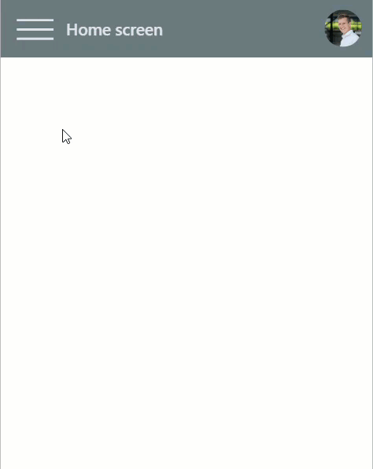

# Hamburger Menu Concept

The Hamburger Menu Concept is a component for PowerApps.

It's basically a header including a Hamburger Menu if the Screens made available.

Download: [HamburgerMenuConcept.msapp](./HamburgerMenuConcept.msapp)



## Set it up

In the App OnStart Action, add the code block below, and modify it to fit your app

```
ClearCollect(
    colScreensMenu,
    {
        Label: "Home",
        DisplayName: "Home screen",
        Screen: HomeScreen
    },
    {
        Label: "Details",
        DisplayName: "Details screen",
        Screen: DetailsScreen
    },
    {
        Label: "Add",
        DisplayName: "Add screen",
        Screen: AddScreen
    }
)
```

* `Label` - Text value shown on the menu button for this screen
* `DisplayName` - Text value shown on the screen heading
* `Screen` - Screen that should be shown. (Note that this one needs to be referencing a valid screen within your app

Then add the component, and you should be ready to go.

## More resources

* [Introducing canvas components](https://powerapps.microsoft.com/en-us/blog/components-available-in-preview/)
* [PowerApps Gallery Navigation](https://powerusers.microsoft.com/t5/General-Discussion/PowerApps-Gallery-Navigation-Help/td-p/59958)
